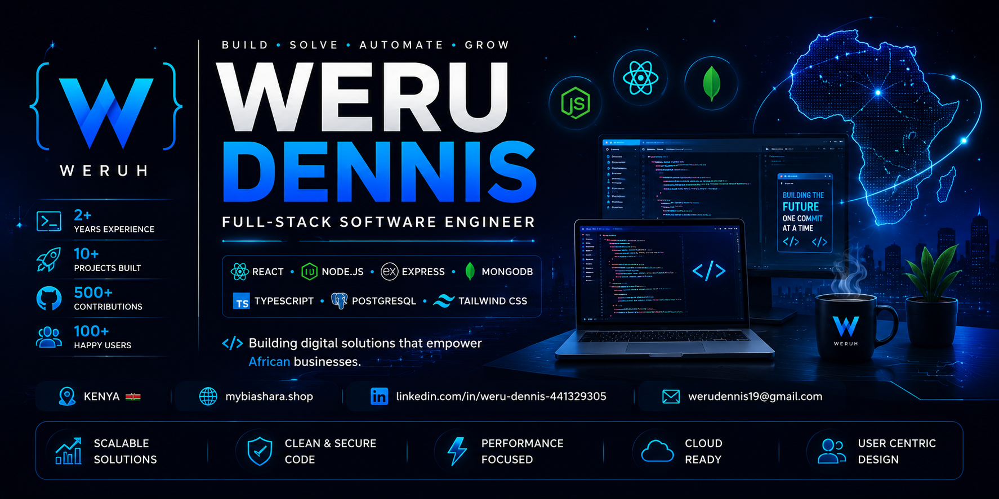

    

<h1 align="center">Hi 👋, I'm Weru Dennis</h1>

<h3 align="center">
Full-Stack Software Developer from Kenya 🇰🇪
</h3>
## 🌍 Connect with Me

## 🚀 About Me

💻 Full-Stack Software Developer

🏢 Founder of MyBiashara.shop

🌍 Building software solutions for African businesses

⚡ Passionate about SaaS, AI, and Cloud Technologies

📚 Currently learning Next.js, PostgreSQL, Docker and AI Automation

🎯 Goal: Build products that impact millions of businesses across Africa

