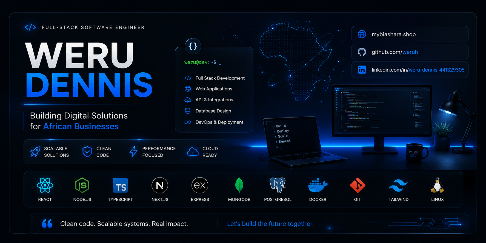

<p align="center">
  
</p>

<h1 align="center">Hi 👋, I'm Weru Dennis</h1>

<h3 align="center">
Junior Backend Developer • Full-Stack Developer • Software Developer
</h3>

<p align="center">
  <a href="https://mybiashara.shop">
    
  </a>
  <a href="https://www.linkedin.com/in/weru-dennis-441329305/">
    
  </a>
  <a href="mailto:werudennis19@gmail.com">
    
  </a>
</p>

---

## 👨‍💻 About Me

I'm a **Junior Backend Developer and Full-Stack Developer from Kenya 🇰🇪**, passionate about building practical software solutions that solve real-world problems.

I have hands-on experience developing web applications, building backend services, working with databases, integrating payment systems, developing APIs, debugging applications, and connecting frontend applications to backend services.

I contributed to the development and launch of **Kujuana.com** at Kujuapoint LLC and have also worked on platforms such as **MyBiashara.shop** and **Niwangu.com**.

I'm currently expanding my backend engineering skills with **Python and Flask**, while strengthening my knowledge of REST APIs, PostgreSQL, testing, Docker, and backend system design.

---

## 🚀 What I Do

* 🔧 Backend API Development
* 🗄️ Database Design & Management
* 🔐 Authentication & Authorization
* 💳 Payment Integrations
* 🔗 REST API Development
* ⚛️ React Frontend Development
* ☁️ Supabase Backend Services
* 🐛 Debugging & Troubleshooting
* 🧪 Testing & Application Reliability
* 🐳 Docker & Development Environments
* 🔀 Git & GitHub Collaboration

---

## 🛠️ Tech Stack

### Backend

<p>
  
</p>

### Frontend

<p>
  
</p>

### Databases & Backend Services

<p>
  
</p>

### Tools & Development

<p>
  
</p>

---

## 💼 Professional Experience

### Junior Backend Developer — Kujuapoint LLC

**November 2025 – February 2026**

Contributed to the development and launch of **Kujuana.com**, working with:

**Node.js • JavaScript • MongoDB • Paystack • Supabase • Git/GitHub**

Key contributions included:

* Developing backend functionality for core application features.
* Working with MongoDB for application data management.
* Integrating Paystack payment services.
* Debugging and resolving backend issues during the platform launch.
* Testing and maintaining backend functionality.
* Contributing to the transition from the initial Node.js/MongoDB backend to Supabase.

---

## 🚀 Featured Projects

### 🏪 MyBiashara.shop

**E-commerce Marketplace & Business Platform**

A marketplace platform designed to help businesses establish online storefronts and sell products digitally.

**Focus:** E-commerce • Business Management • Payments • SaaS

**Technologies:** React • Node.js • MongoDB • Supabase • Payment APIs

🔗 **Live Demo:** [mybiashara.shop](https://mybiashara.shop)

---

### 💙 Niwangu.com

**Social & Dating Platform**

A platform designed to connect users through profiles, discovery, matching, and subscription-based features.

**Focus:** User Management • Matching • Subscriptions • Payments

**Technologies:** React • Supabase • PostgreSQL • Edge Functions • M-Pesa

🔗 **Live Demo:** [niwangu.com](https://niwangu.com)

---

### 🏥 Tajiluxuryevents.com

**Event Booking Platform**

An event-focused website designed to showcase services and support event-related bookings and customer interactions.

**Focus:** Web Development • Booking • Responsive UI

🔗 **Live Demo:** [tajiluxuryevents.com](https://tajiluxuryevents.com)

---

### 📚 joelkariuki.com

**Coaching & Personal Brand Website**

A coaching-driven website designed to present services, information, and resources through a professional web presence.

**Focus:** Web Development • Responsive Design • Content Presentation

🔗 **Live Demo:** [joelkariuki.com](https://joelkariuki.com)

---

## 🧠 Currently Learning

I'm currently strengthening my backend engineering skills with:

```text
Python
   ↓
Flask
   ↓
REST APIs
   ↓
PostgreSQL
   ↓
Authentication
   ↓
Testing
   ↓
Docker
   ↓
Backend System Design
```

I'm particularly interested in becoming stronger in **backend architecture, API development, databases, testing, system design, and cloud-based applications**.

---

## 📊 GitHub Statistics

<p align="center">
  
</p>

<p align="center">
  
</p>

---

## 🏆 GitHub Trophies

<p align="center">
  
</p>

---

## 🎯 Career Focus

I'm looking for opportunities as a **Junior Backend Developer or Full-Stack Developer**, where I can contribute to real-world software products while continuing to grow as a backend engineer.

### Areas I'm focused on:

**Python • Flask • Node.js • REST APIs • PostgreSQL • Supabase • Docker**

---

## ⚡ Developer Mindset

```javascript
while (alive) {
    learn();
    build();
    solve();
    improve();
    deploy();
}
```

---

## 🌍 My Goal

> Building reliable software that solves real problems and creates opportunities for businesses and communities across Africa.

---

<p align="center">
  
</p>

<p align="center">
  <b>Thanks for visiting my profile! 🚀</b>
</p>
